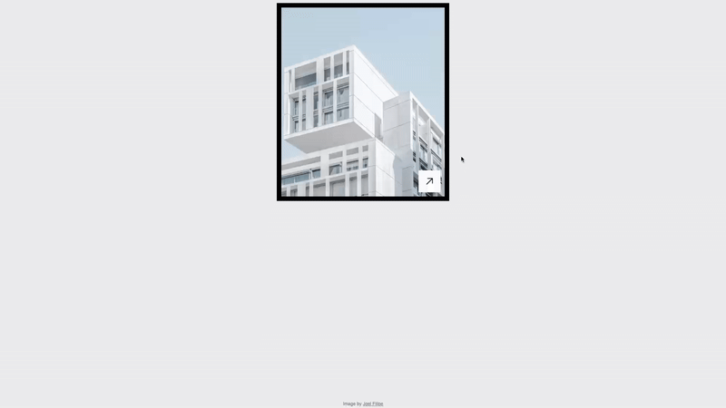

# Interactive Real Estate Card

A modern real estate card component built with React, featuring smooth hover animations and dynamic property information display. This project showcases elegant UI design and CSS transitions for an engaging user experience.



[Live Demo](https://floriansimunek.com/projects/modern-real-estate-card/) | [Github Repository](https://github.com/floriansimunek/Modern-Real-Estate-Card) | [Inspiration 1](https://dribbble.com/shots/25763777-Ecommerce-Product-Card-UI) | [Inspiration 2](https://x.com/ini_SZN/status/1895183454792196427/photo/1)

## Features

- Interactive card with smooth hover effects
- Dynamic property details reveal on hover
- Animated image scaling for an immersive feel
- Responsive design adaptable to different screen sizes

## Technical Implementation

This project demonstrates refined front-end techniques including:

- **CSS Transitions** for seamless animations on hover
- **React Component Structure** for modular UI design
- **Dynamic Data Handling** for property details
- **Hover-based Interactions** for engaging user experience

## Project Structure

```
real-estate-card/
├── src/
│   ├── components/
│   │   ├── Card/
│   │   │   ├── index.js
│   │   │   ├── Card.jsx
│   │   │   └── Card.module.css
│   ├── assets/
│   │   ├── arrow.svg
│   │   ├── image.jpg
│   ├── App.jsx
│   ├── App.module.css
│   └── main.jsx
```

## How It Works

### Hover Animation Effects

The interactive card reveals property details dynamically on hover:

- **Image Scaling**: The property image smoothly enlarges when hovered.
- **Text Transition**: Property details slide into view with a fade-in effect.
- **Arrow Indicator**: An animated arrow appears for better navigation.

```css
.card:hover .cardImage {
  transform: scale(1.1);
  transform-origin: 50% 50%;
}

.card:hover .arrowContainer {
  transform: scale(1);
}

.card:hover .cardInfos {
  transform: translateY(0);
}
```

### Card Structure

The card is divided into three main sections:

- **Image Container**: Displays the property image with scaling effects.
- **Information Panel**: Shows price, beds, baths, and size dynamically.
- **CTA Button**: A call-to-action button to view more details.

## Key Technologies

- React
- CSS Modules
- JavaScript for UI Interactions

This project is a great example of how simple yet effective animations can enhance UI interactions in real-world applications.
